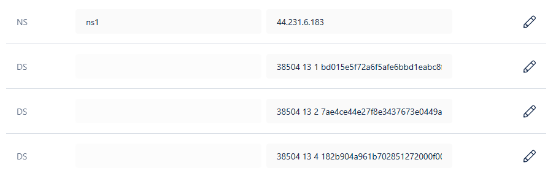
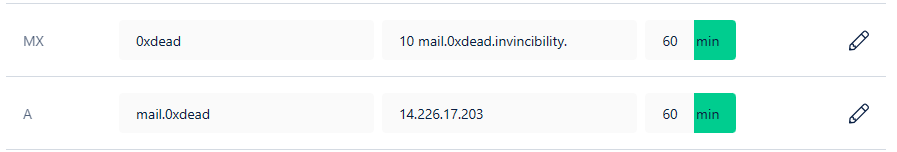
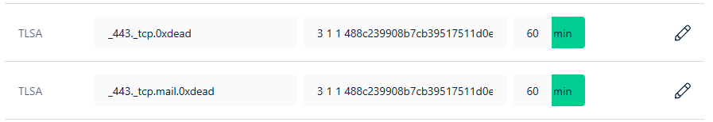
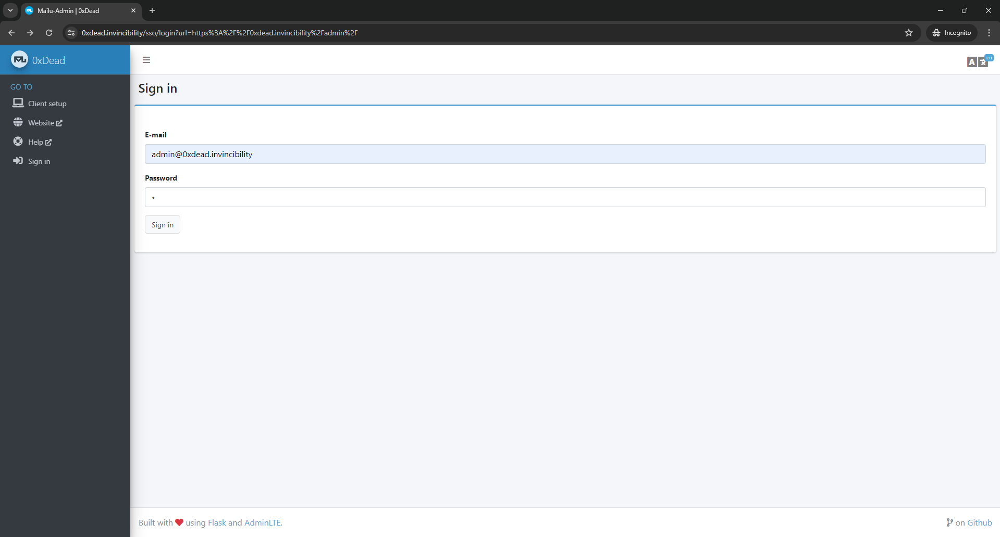

<!-- Improved compatibility of back to top link: See: https://github.com/othneildrew/Best-README-Template/pull/73 -->
<a name="readme-top"></a>
<!--
*** Thanks for checking out the Best-README-Template. If you have a suggestion
*** that would make this better, please fork the repo and create a pull request
*** or simply open an issue with the tag "enhancement".
*** Don't forget to give the project a star!
*** Thanks again! Now go create something AMAZING! :D
-->

<!-- PROJECT SHIELDS -->
<!--
*** I'm using markdown "reference style" links for readability.
*** Reference links are enclosed in brackets [ ] instead of parentheses ( ).
*** See the bottom of this document for the declaration of the reference variables
*** for contributors-url, forks-url, etc. This is an optional, concise syntax you may use.
*** https://www.markdownguide.org/basic-syntax/#reference-style-links
-->
[![Contributors][contributors-shield]][contributors-url]
[![Forks][forks-shield]][forks-url]
[![Stargazers][stars-shield]][stars-url]
[![Issues][issues-shield]][issues-url]
[![MIT License][license-shield]][license-url]

<br />
<div align="center">

<h3 align="center">0xDeAd</h3>

  <p align="center">
    Docker based one-click Mailu mail server setup
    <br />
    <a href="https://github.com/0xDeAd-team/instruction"><strong>Explore the docs »</strong></a>
    <br />
    <br />
  </p>
</div>

<details>
  <summary>Table of Contents</summary>
  <ol>
    <li>
      <a href="#demo">Demo</a>
    </li>
    <li>
      <a href="#about-the-project">About The Project</a>
      <ul>
        <li><a href="#docker-based-one-click-mailu-mail-server-simplify-your-email-hosting">Docker Based One-Click Mailu Mail Server: Simplify Your Email Hosting</a></li>
        <li><a href="#benefits">Benefits</a></li>
        <li><a href="#mailu-features">Mailu Features</a></li>
      </ul>
    </li>
    <li>
      <a href="#instruction">Instruction</a>
      <ul>
        <li><a href="#prerequisites">Prerequisites</a></li>
        <li><a href="#config-dns-record">Config DNS record</a></li>
        <li><a href="#config-hnsd-for-dns-resolution">Config HNSD for DNS resolution</a></li>
        <li><a href="#run-the-mail-server">Run the mail server</a></li>
      </ul>
    </li>
    <li><a href="#usage">Usage</a></li>
    <li><a href="#contributing">Contributing</a></li>
    <li><a href="#license">License</a></li>
    <li><a href="#contact">Contact</a></li>
  </ol>
</details>

## Demo

For sample demo mail server. Please visit at: [0xDeAd Mail](https://0xdead.invincibility/) with Guest account, default password is `[our-team-name]@[account-name]`

- `guest1@0xdead.invincibility`
- `guest2@0xdead.invincibility`

See the [Usage](#usage) below for more detail about E2E encryption and Handshake cross domain mail.

## About The Project

### Docker Based One-Click Mailu Mail Server: Simplify Your Email Hosting

This repository provides a streamlined script for setting up a secure and private email server using Mailu. With just one click, you can deploy a fully functional Mailu server, eliminating the complexities of manual configuration.

### Benefits

- **Effortless Setup**: No more spending hours configuring your mail server. Our script automates the entire process, making it accessible to users of all technical backgrounds.
- **Secure Communication**: Mailu prioritizes security, ensuring your emails are protected with robust encryption features.
- **Take Control**: Host your own email server and avoid relying on third-party providers who may access your data.
- **Open-Source Advantage**: Leverage the power and flexibility of open-source software with Mailu and this convenient setup script.

### Mailu Features

- **Standard email server**, IMAP and IMAP+, SMTP and Submission with auto-configuration profiles for clients
- **Advanced email features**, aliases, domain aliases, custom routing, full-text search of email attachments
- **Web access**, multiple Webmails and administration interface
- **User features**, aliases, auto-reply, auto-forward, fetched accounts, managesieve
- **Admin features**, global admins, announcements, per-domain delegation, quotas
- **Security**, enforced TLS, DANE, MTA-STS, Letsencrypt!, outgoing DKIM, anti-virus scanner, [Snuffleupagus](https://github.com/jvoisin/snuffleupagus/), block malicious attachments
- **Antispam**, auto-learn, greylisting, DMARC and SPF, anti-spoofing
- **Freedom**, all FOSS components, no tracker included
- **E2E Encryption**, protect your most sensitive communications with end-to-end encryption, secured by powerful publickey encryption algorithms like ECC secp256k1, RSA 2048, RSA 4096

<p align="right">(<a href="#readme-top">back to top</a>)</p>

## Instruction

This tutorial is written for Ubuntu22.04 LTS operating system. For other systems, feel free to use it as a reference and make the script yourself.

### Prerequisites

- A HandShake domain, you can buy at [Namebase](https://namebase.io)

- A Ubuntu22.04 server with following tools installed  

- `docker`
to run the mail server inside containers

  ```sh
  curl -fsSL https://get.docker.com -o get-docker.sh
  sudo sh get-docker.sh

  sudo groupadd docker
  sudo usermod -aG docker $USER
  newgrp docker

  sudo systemctl enable docker.service
  sudo systemctl enable containerd.service
  ```

- `yq`
to modify the yaml config file

  ```sh
  wget https://github.com/mikefarah/yq/releases/latest/download/yq_linux_amd64 -O /usr/bin/yq &&\
    chmod +x /usr/bin/yq
  ```

- `openssl`
to generate self-signed certificate

  ```sh
  sudo apt install openssl
  ```

### Config DNS record

Go to [Namebase](https://namebase.io) to config your DNS record

**Blockchain DNS records (On-chain record)**  
Handshake allows a limited set of DNS record types on chain.

- Make sure to enable DNSSEC for your domain and Namebase will automaticcaly add 3 DS records

- To use Namebase's nameservers, create an NS record in the blockchain section with a "Name" of `ns1` and a "Value" of `44.231.6.183`



**Namebase nameserver DNS records (Off-chain record)**  

- Add an A record for your mail server
- Add an MX record for your mail domain



- For HTTPS certificate validation, add TLSA record for your domain



### Config [HNSD](https://github.com/handshake-org/hnsd) for DNS resolution

1. Run HNSD
using docker (optional)

  ```sh
  docker run -d --name hnsd --restart always -p 53:53/udp namebasehq/hnsd "/opt/hnsd/dist/hnsd" -p 4 -r 127.0.0.1:53
  ```

2. Add the following line to the top of the `/etc/resolv.conf` file

Using your own HNSD server

  ```sh
  nameserver 127.0.0.1
  ```

Or using public HNSD server

  ```sh
  nameserver 103.196.38.38
  nameserver 103.196.38.39
  ```

It took a while for HNSD to finish running. You can ping a Handshake domain to check everything is working properly

  ```sh
  ping your.domain
  ```

### Run the mail server

1. Clone the repository

    ```sh
    git clone https://github.com/0xDeAd-team/instruction.git
    ```

2. Prepare environment variables

- **DOMAIN**: Your main mail domain and server display name
- **HOSTNAMES**: Your server's actual hostnames. Every e-mail domain that points to this server must have one of the hostnames in its MX record
- **API_KEY**: API-key to use admin API configuration
- **LISTEN_ADDRESS**: Address which nginx reverse proxy container will be exposed to. You must use specific addresses, please avoid generic all-interfaces addresses like `0.0.0.0` or `::`.
- **WORKING_DIR**: the directory where your server stored
- **ADMIN_PASSWORD**: initial admin password

    ```sh
    export DOMAIN=0xdead.invincibility \
    HOSTNAMES=mail.0xdead.invincibility \
    API_KEY=THISISAPIKEY \
    LISTEN_ADDRESS=127.0.0.1 \
    WORKING_DIR=~/mailu \
    ADMIN_PASSWORD=123456
    ```

3. Run `setup.sh`

   ```sh
   ./setup.sh
   ```

And wait few seconds and the script will do all the rest for you, from get the config file to run the docker compose containers. You can get this login web page when your server is ready


<p align="right">(<a href="#readme-top">back to top</a>)</p>

## Usage

- **To send and receive email from others HandShake domain mail servers, both 2 servers need to set up HNSD to resolve DNS.**

With demo website [above](#demo), you can try to send email to `@moon.allinpepetothemoon` mail domain of ToTheMoon team.


- **To use E2E encryption, go to webmail client settings and create your PGP keys. Remember that if you want to send encrypted mail for some one, you need to have his public key first to encrypt the mail.**


<p align="right">(<a href="#readme-top">back to top</a>)</p>

## Contributing

Contributions are what make the open source community such an amazing place to learn, inspire, and create. Any contributions you make are **greatly appreciated**.

If you have a suggestion that would make this better, please fork the repo and create a pull request. You can also simply open an issue with the tag "enhancement".
Don't forget to give the project a star! Thanks again!

1. Fork the Project
2. Create your Feature Branch (`git checkout -b feature/AmazingFeature`)
3. Commit your Changes (`git commit -m 'Add some AmazingFeature'`)
4. Push to the Branch (`git push origin feature/AmazingFeature`)
5. Open a Pull Request

<p align="right">(<a href="#readme-top">back to top</a>)</p>

## License

Distributed under the MIT License. See `LICENSE` for more information.

<p align="right">(<a href="#readme-top">back to top</a>)</p>

## Contact

0xDeAd-team - <admin@0xdead.invincibility>

Project Link: [https://github.com/0xDeAd-team/instruction](https://github.com/0xDeAd-team/instruction)

<p align="right">(<a href="#readme-top">back to top</a>)</p>

[contributors-shield]: https://img.shields.io/github/contributors/0xDeAd-team/instruction.svg?style=for-the-badge
[contributors-url]: https://github.com/0xDeAd-team/instruction/graphs/contributors
[forks-shield]: https://img.shields.io/github/forks/0xDeAd-team/instruction.svg?style=for-the-badge
[forks-url]: https://github.com/0xDeAd-team/instruction/network/members
[stars-shield]: https://img.shields.io/github/stars/0xDeAd-team/instruction.svg?style=for-the-badge
[stars-url]: https://github.com/0xDeAd-team/instruction/stargazers
[issues-shield]: https://img.shields.io/github/issues/0xDeAd-team/instruction.svg?style=for-the-badge
[issues-url]: https://github.com/0xDeAd-team/instruction/issues
[license-shield]: https://img.shields.io/github/license/0xDeAd-team/instruction.svg?style=for-the-badge
[license-url]: https://github.com/0xDeAd-team/instruction/blob/master/LICENSE.txt
